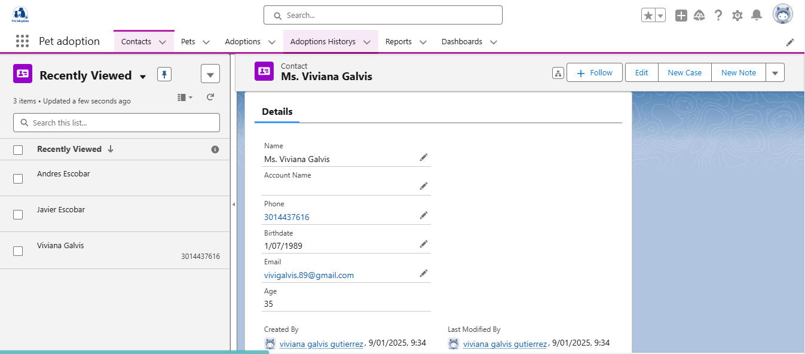
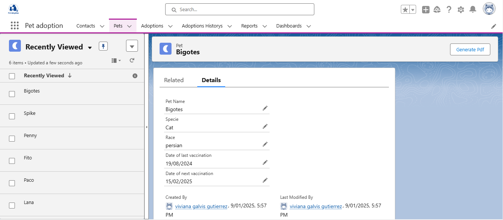
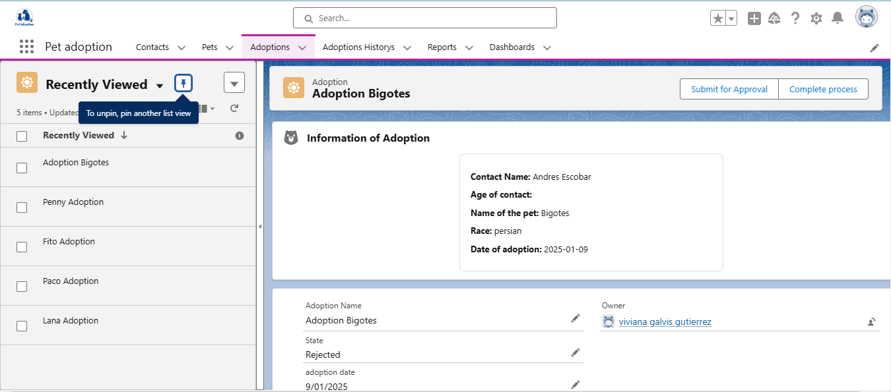
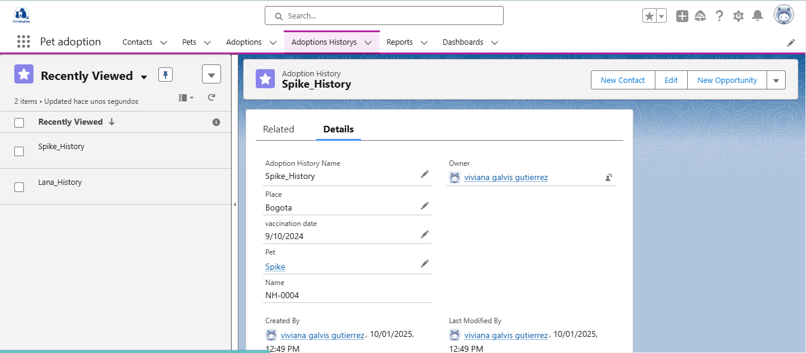
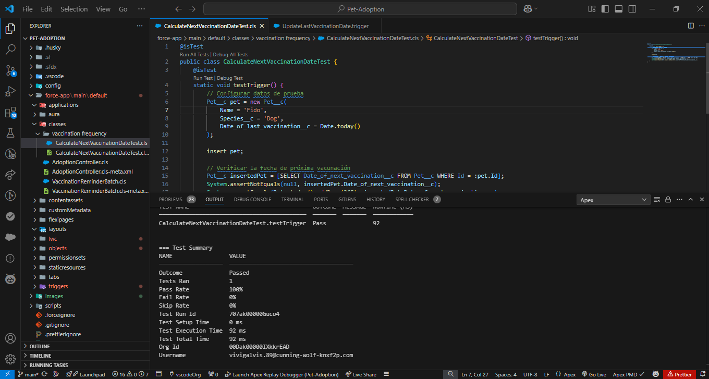
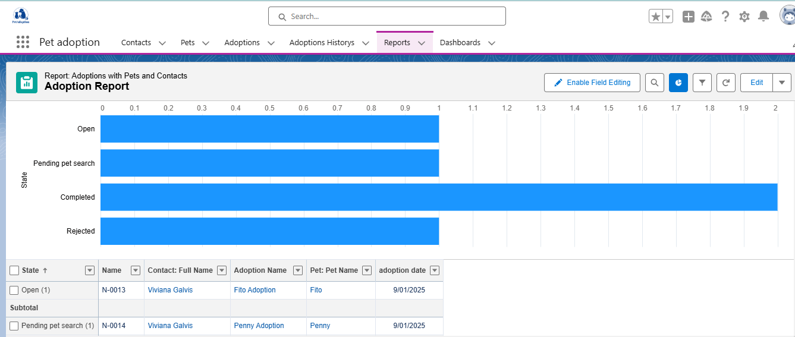
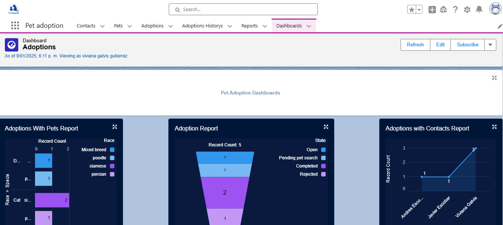

🐾 Adopción de Mascotas - Everymind
🚀 Un proyecto innovador para la gestión de adopciones de mascotas con Salesforce

🌟 Descripción
Este proyecto es una solución técnica diseñada para controlar y registrar adopciones de mascotas de manera eficiente. Incluye procesos automatizados, validaciones avanzadas y reportes que mejoran la experiencia de usuarios y administradores.

🎯 Objetivos del Proyecto
 * Evaluar el rendimiento técnico y conocimiento de la plataforma Salesforce.
 * Crear una solución funcional con objetos personalizados, procesos automatizados y análisis de KPI.

🛠️ Funcionalidades Principales

👨‍👩‍👧‍👦 Contactos
 * Registro de datos básicos (nombre, teléfono, correo).
 * Cálculo automático de la edad basado en la fecha de nacimiento.

🐕‍🦺 Mascotas
 * Gestión de especies, razas y vacunación.
 * Campos dependientes: selección de raza según la especie.

📋 Adopciones
 * Automatización de estados: Abierto, En aprobación, Rechazado, Finalizado.
 * Proceso de aprobación con notificaciones por correo.

💉 Historial de Vacunación
 * Registro automático de fechas.
 * Recordatorios diarios para mascotas con vacunas pendientes.

📊 Reportes y KPIs
Análisis de adopciones, procesos y estado general de la gestión.

💻 Requerimientos Técnicos
1. Salesforce: Creación de objetos y automatización de procesos.
2. Apex: Desarrollo de triggers, schedulers y lógica personalizada.
3. Lightning Web Components (LWC): Interfaz visual para información clave.
4. Pruebas Unitarias: Cobertura mínima del 75%.

⚙️ Guía de Configuración

1. Clonar el repositorio
bash
git clone <https://github.com/Vivisgalvis/Pet-Adoption.git>
cd Pet-Adoption
2. Importar el proyecto en Salesforce.
3. Crear un usuario de prueba con los siguientes datos:
 * Apellido: Educación
 * Correo Electrónico: education@everymind.com.br
 * Nombre de usuario: vivana.educacion@bestminds.com.bm2022-01
 * Perfil: Administrador del sistema.

 🚀 Cómo Usar el Proyecto
🐾 Pasos Principales

1. Crear Objetos Personalizados:
 * Contactos
 * Mascotas
 * Adopciones
 * Historial de vacunación

2. Configurar Automatizaciones:
 * Estados de adopción según el flujo definido.
 * Notificaciones de estado y correos electrónicos automáticos.

3. Implementar Funcionalidades Clave:
 * Certificados PDF para mascotas.
 * Recordatorios automáticos de vacunación.

4. Ejecutar Pruebas Unitarias:
 * Asegurarse de alcanzar el 75% de cobertura.

🖼️ Capturas de Pantalla

1. Diseño de registros y páginas Lightning.
    
    
    
    

2. Resultados de pruebas unitarias en Apex.
    

3. Reportes y dashboards de KPI.
    
    

